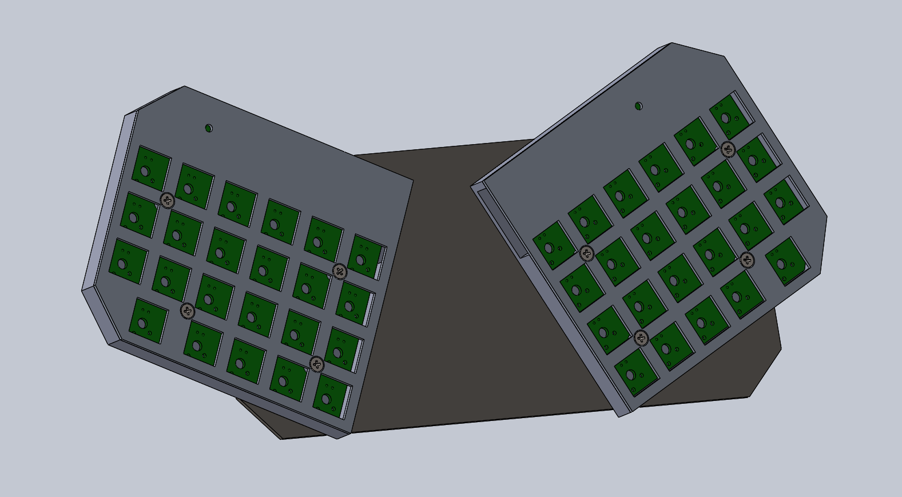

# Splitboard

This is the ressources we use to create our split, type matrix, bluetooth, mecanical custom keyboard.

Still in construction !

We used a lot of different technologies (solidworks for example), so you probably will not be able to recreate exactly the same keyboard.

But we added ressources you can use if you want to make your own !

## Description

pcb + 3d-printed box + aluminium plate + brown switches + adafruit feather 32u4

### Design goals:

- portable

- splited

- type matrix

- mecanical

- robust

- usb and bluetooth

Our keyboard supports usb and bluetooth (BLE) communication with the *hid* specification.

## Content:

 - board design, with all components (kicad and gerber files) -> `pcb`
 - arduino code -> `code`
 - 3d modeling of the entire keyboard (solidworks and printable files) -> `3d`

## 3d structure:

multiple layers:

- support

- box

- pcb

- plate

- switches

We chose the [cherry mx brown](https://www.cherrymx.de/en/mx-original/mx-brown.html).

Before buying, try to find a second-hand broken keyboard somewhere !

## PCB and electronics:

We used the [adafruit 32u4](https://learn.adafruit.com/adafruit-feather-32u4-bluefruit-le/overview).

## Software:

### Arduino

you can test our sketches if you have a 32u4 adafruit feather.

linux with arduino-cli:

First, make sure you are part of the `uucp` group.
If not, use the command `gpasswd -a $USER uucp`

`arduino-cli core install adafruit:avr`

find the board connected to usb (look at the *Port* path):
`arduino-cli board list` 

`arduino-cli board attach adafruit:avr:feather32u4`
`arduino-cli compile`
`arduino-cli upload`

### Ressources:
https://wiki.osdev.org/USB_Human_Interface_Devices

## TODO:

- [ ] add links to documentation
- [ ] add images
